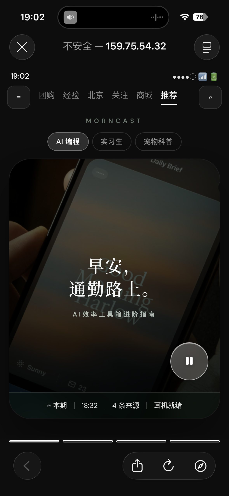
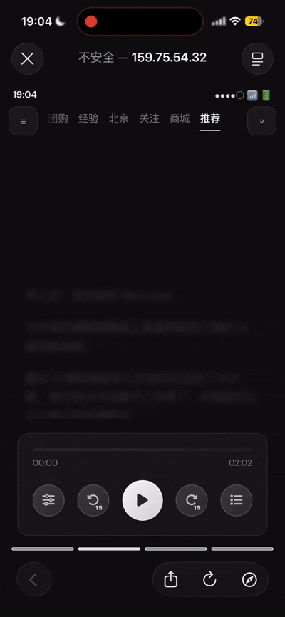
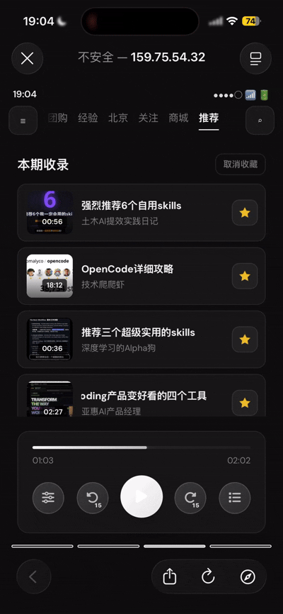
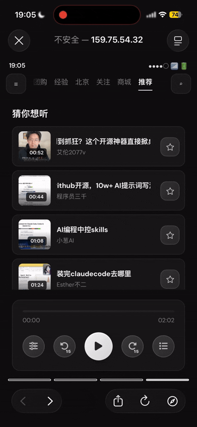

**morncast**是一款面向总是“收藏了却没时间看”的人，在通勤路上，通过把收藏内容变成可直接收听的播客，用最低负担的方式完成信息消化。

## 🚀 快速开始

### 1、手机扫码体验

<table>
<tr>
<td width="208" valign="middle">
  
</td>
<td valign="middle">
  扫描左侧二维码即可快速体验 morncast 😊
</td>
</tr>
</table>

### 2. 本地部署

需已安装 **Miniconda** 或 **Anaconda**。在仓库根目录执行：

**创建 Conda 环境并安装依赖**

仓库根目录下的 **`environment.yml`** 会创建名为 **`morncast`** 的环境，并通过 pip 安装 **`requirements.txt`** 中的包：

```bash
cd 仓库根目录
conda env create -f environment.yml   # 首次
conda activate morncast
```

之后若 **`environment.yml` 或 `requirements.txt`** 有变动，可更新环境：

```bash
conda activate morncast
conda env update -f environment.yml
```

**配置环境变量**

在项目根目录创建的 `.env` 进行配置（勿提交真实密钥到公开仓库），至少配置大模型相关项：

| 变量 | 说明 |
|------|------|
| `LLM_API_KEY` | **必填**。与所用网关一致；若使用火山方舟，一般为以 `ark-` 开头的 Key。 |
| `LLM_BASE_URL` | 可选。默认 `https://ark.cn-beijing.volces.com/api/v3`（OpenAI 兼容）。 |
| `LLM_MODEL` | 可选。默认 `doubao-seed-2-0-lite-260215`，需与控制台里已开通的推理接入点一致。 |
| `TTS_VOICE` / `TTS_RATE` | 可选。Edge TTS 音色与语速，默认见 `server.py`。 |

- 火山方舟API调用快速入门: [quickstart](https://www.volcengine.com/docs/82379/2272060?lang=zh)

**启动服务**

务必在 **项目根目录** 启动，以便正确加载 `.env` 与相对路径：

```bash
uvicorn server:app --reload
```

默认监听 `http://127.0.0.1:8000`。浏览器打开该地址即可；首次打开会请求 **`GET /api/brief`**，串联 **大模型写稿**与 **Edge TTS 合成**，可能需要约 **10～20 秒**。

## 🏗️ 整体框架

> [!WARNING]
> 待写

## ✨ 产品功能

<table align="center" width="100%">
  <colgroup>
    <col width="25%" />
    <col width="25%" />
    <col width="25%" />
    <col width="25%" />
  </colgroup>
  <thead>
    <tr align="center">
      <th>· 零输入一键合成</th>
      <th>· 现代播放器功能</th>
      <th>· 内容溯源</th>
      <th>· 延伸推荐</th>
    </tr>
  </thead>
  <tbody>
    <tr>
      <td align="center" valign="middle" height="400">
        
      </td>
      <td align="center" valign="middle" height="400">
        
      </td>
      <td align="center" valign="middle" height="400">
        
      </td>
      <td align="center" valign="middle" height="400">
        
      </td>
    </tr>
    <tr>
      <td align="center" valign="top"><small>自动播客合成</small></td>
      <td align="center" valign="top"><small>逐句高亮 / 章节跳转<br />时长刻度 · 播放倍速</small></td>
      <td align="center" valign="top"><small>收藏来源管理</small></td>
      <td align="center" valign="top"><small>收藏更多视频<br />便于后续生成与推送</small></td>
    </tr>
  </tbody>
</table>

## 📚 文档

- 产品宣传海报: [pic](./docs/海报.png)
- 产品说明书: [prd](./docs/PRD.pdf)
- 后端框架说明: [architecture](./docs/backend-plan.md)


