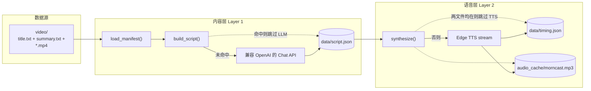

# Morncast 后端系统架构说明

面向「开箱即播」的通勤播课 Demo：**内置 `video/` 素材**，通过 **两层可缓存流水线** 生成脚本与音频，再由 **`GET /api/brief`** 聚合为前端所需 JSON。全文描述**运行时结构**与**边界**，不包含排期或个人开发清单。

---

## 1. 架构总览

| 关注点 | 说明 |
|--------|------|
| 运行时 | FastAPI 单进程：`server.py`，同步 HTTP + 异步 TTS 流式写入。 |
| 入口 | **`GET /api/brief`**：唯一数据入口；前端直接请求并渲染。 |
| 机密与配置 | `LLM_*`、`TTS_*` 经由 **环境变量 / `.env`**（`python-dotenv`）；不在前端或服务端硬编码 Key。 |

---

## 2. 数据源与_manifest_

**主链路**依赖仓库内 **`video/`**：

- **`title.txt` / `summary.txt`**：按编号锚点解析为多「条」，与 `AUTHORS`、`video/*.mp4` 等对齐（具体规则见 `server.py` 内 `load_manifest()`）。
- **视频文件**：经 **`/videos`** 静态挂载提供给前端跳转原片；不参与实时转码或服务端流媒体处理。

设计中 **不要求用户输入**：摘要内容由内置清单驱动，以实现「打开即 hydrate」的体验。

---

## 3. 两层流水线（与缓存契约）

系统将「播课文稿生成」与「语音合成」拆成两段，**各自的缓存互相独立**，便于单独失效与计价（LLM 与 Edge TTS 分离）。

### Layer 0：清单解析

- **`load_manifest()`**：将 `video/` 下文本映射为结构化列表（每条含 `id`、`title`、`summary`、可选 `videoFile` 等）。
- **无磁盘缓存层名称**；输出直接供 Layer 1 使用。

### Layer 1：内容层（`build_script`）

- **输入**：manifest 的子集（如参与脚本的前 N 条 + 不参与脚本的展示位）。
- **输出**：标题、正文 `script`、`chapters`（按字符偏移）。
- **缓存文件**： **`data/script.json`**。  
  **命中策略**：文件存在即整段跳过 LLM，直接反序列化为脚本结构。

### Layer 2：语音层（`synthesize`）

- **输入**：Layer 1 的正文字符串。
- **输出**：`totalSec`、句级 **`transcriptLines`**（时间戳 + 文本）。
- **实现要点**：Edge TTS `Communicate.stream()`，当前从流中消费 **`SentenceBoundary`** 组装句级时间轴（实现细节以 `server.py` 为准）。
- **缓存文件**：  
  - **`audio_cache/morncast.mp3`**（固定文件名）  
  - **`data/timing.json`**  
  **命中策略**：**两个文件都存在**时才跳过 TTS，并只读取 `timing.json` 返回；任一缺失则重跑合成并覆盖。

### 为何要分层缓存

| 变更类型 | 建议失效 |
|----------|----------|
| 改摘要、改 Prompt、改 Layer 1 逻辑 | 删除 **`data/script.json`**（脚本变则下游音频意义也变，通常需一并清 Layer 2） |
| 改音色 / 语速 / TTS、只重合成 | 删除 **`audio_cache/morncast.mp3`** 与 **`data/timing.json`**，保留 `script.json` 可节省 LLM 费用 |
| 全量重算 | 上述三处均可删 |

---

## 4. HTTP 与静态资源

### 聚合接口

**`GET /api/brief`**

- 串联：校验 `LLM_API_KEY` → `load_manifest` → `build_script` → `synthesize` → 将章节 `char_start` 转为时间轴上的 `start`（与当前 `server.py` 中 `chars_per_sec` 策略一致）。
- 响应包含：`title`、`audioUrl`（固定指向 **`/audio/morncast.mp3`**）、`totalSec`、`chapters`、`transcriptLines`、`sources`、`recommendations` 等，供单页前端直接渲染。

### 静态挂载（与路径约定）

| 挂载路径 | 目录 | 用途 |
|----------|------|------|
| `/audio` | `audio_cache/` | TTS 输出 MP3 |
| `/assets` | `frontend/assets/` | 前端子资源（配图、字体等） |
| `/videos` | `video/` | 原视频文件 |
| `/pic` | `pic/`（若存在） | 封面等 |

根路径 **`GET /`** 返回 **`frontend/index.html`**，实现前后端同源、相对路径 `/api/*` 与静态资源一致。

---

## 5. 明确不在本后端范围内的能力

以下为产品或后续迭代方向，**当前 `server.py` 不承担**：

- 抖音链接拉取、在线字幕抓取、爬虫。
- 用户账号、收藏状态的持久化与多端同步。
- 视频缩略图实时截帧（当前可用占位 thumb 策略）。
- 与 README 中可能提及的 **`POST /api/generate-brief`** 等接口：以仓库内 **`server.py` 实际路由** 为准。

---

## 6. 部署与运行时注意（架构约束）

- **工作目录**：`load_dotenv()` 默认在进程 **CWD** 找 **`.env`**，宜在**项目根**启动 `uvicorn`，避免找不到配置与相对路径错乱。
- **Edge TTS**：Layer 2 冷跑依赖本机或服务能访问 Edge TTS；部分网络环境不可用，实践中常依赖 **预生成缓存** 或 **`deploy.sh` 推送带缓存的目录**（部署脚本文档另行说明）。
- **`data/`、`audio_cache/`**：通常不入版本库（见 `.gitignore`），在不同环境表现为「冷启动重新算」或「随部署包携带缓存」两种模式。

---

以上描述与仓库中 **`server.py` 代码** 一致；若实现变更，应以代码为准并同步修订本文。
